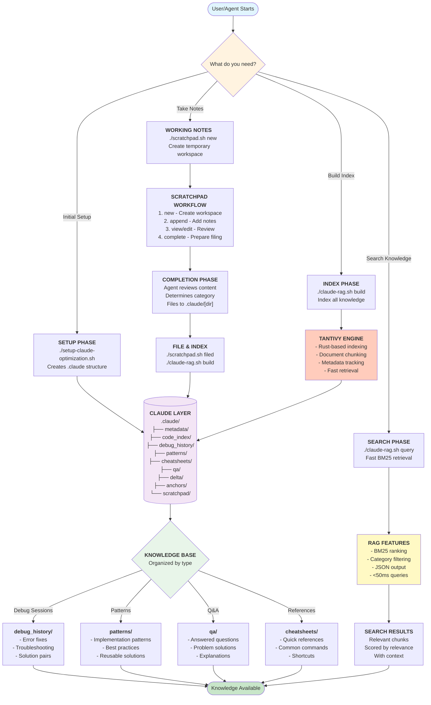

# Architecture Flow - LLM Agent Tools

## Updated System Architecture

## Key Improvements from Previous Version

### 1. **Simplified Architecture**
- **Before**: Multiple tools (researcher, architect, codemap, etc.)
- **After**: Three core tools (setup, scratchpad, claude-rag)

### 2. **Persistent Knowledge Structure**
- **Before**: Memory bank with various subdirectories
- **After**: Organized .claude directory with clear categories

### 3. **Integrated Search**
- **Before**: No search capability
- **After**: Fast BM25 search with Tantivy

### 4. **Workflow Optimization**
- **Before**: Complex multi-agent coordination
- **After**: Simple scratchpad → file → search workflow

### 5. **Performance**
- **Before**: File-based lookups
- **After**: <50ms indexed searches

## Usage Flow

1. **Setup Once**: `./setup-claude-optimization.sh`
2. **Work Loop**:
   - Create scratchpad for task
   - Add notes while working
   - Complete and file to appropriate category
   - Rebuild index
   - Search when needed

## Benefits

- **Simplicity**: Fewer tools, clearer workflow
- **Speed**: Rust-based indexing and retrieval
- **Organization**: Systematic categorization
- **Persistence**: Knowledge grows over time
- **Searchability**: Everything is indexed and queryable