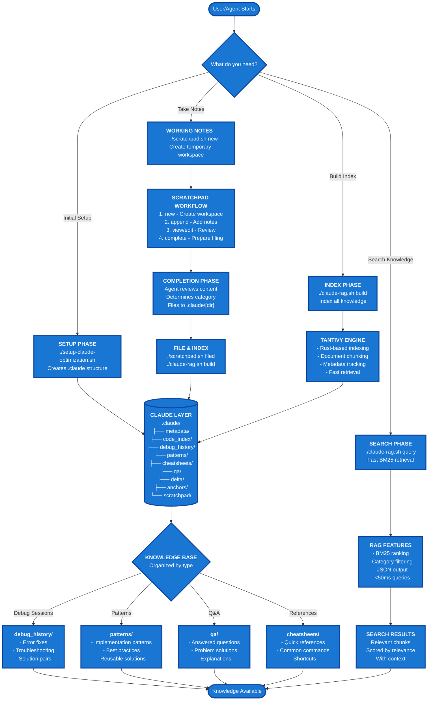

# LLM Agent Tools

A comprehensive toolkit for AI agents to manage knowledge, take notes, and retrieve information efficiently.

## System Architecture



## Tools Overview

### 1. **setup-claude-optimization.sh**
Creates the `.claude` directory structure for organized knowledge management.

### 2. **scratchpad.sh**
Temporary note-taking system for AI agents during work sessions.

### 3. **claude-rag.sh** (Requires Rust)
Wrapper script for fast search using Rust/Tantivy. This script:
- Automatically builds the Rust tools on first run
- Provides simple commands for indexing and searching
- Handles the complexity of the underlying Rust binaries

**Note:** This requires Rust to be installed. Without Rust, you can still use scratchpad.sh and the .claude directory structure.

#### Using claude-rag.sh:
```bash
# If you have Rust installed:
./claude-rag.sh build     # Build/rebuild the search index
./claude-rag.sh query "search term"    # Search your knowledge base
./claude-rag.sh query "error" --category debug_history
./claude-rag.sh stats     # Show index statistics
```

#### Alternative: Using the Rust tools directly
If you prefer to use the Rust tools without the wrapper:
```bash
# Clone and build
git clone https://github.com/alchemiststudiosDOTai/llm-agent-tools.git
cd llm-agent-tools/claude-rag
cargo build --release

# Copy binaries to your project
cp target/release/build_index target/release/retrieve /path/to/your/project/

# Use directly
./build_index              # Indexes .claude directory
./retrieve "search term"   # Search for content
```

## Quick Start

```bash
# 1. Setup (only needed once)
./setup-claude-optimization.sh

# 2. Create a scratchpad for your work
./scratchpad.sh new task "implement feature X"

# 3. Add notes as you work
./scratchpad.sh append task_implement_feature_X "Found solution: use pattern Y"

# 4. Complete and file the scratchpad
./scratchpad.sh complete task_implement_feature_X
# Then file it to appropriate .claude directory
./scratchpad.sh filed task_implement_feature_X

# 5. Build/update the search index
./claude-rag.sh build

# 6. Search your knowledge base
./claude-rag.sh query "pattern Y"
```

## Example Workflow

### Debugging Session Example

```bash
# Start debugging session
./scratchpad.sh new debug "API timeout issue"

# Add findings
./scratchpad.sh append debug_API_timeout_issue "Error occurs after 30s"
./scratchpad.sh append debug_API_timeout_issue "Root cause: missing timeout config"

# Complete and review
./scratchpad.sh complete debug_API_timeout_issue

# File to debug_history
echo "Filing to .claude/debug_history/api_timeout_fix.md"
# [AI agent writes the file]

# Mark as filed
./scratchpad.sh filed debug_API_timeout_issue

# Update search index
./claude-rag.sh build

# Later, search for similar issues
./claude-rag.sh query "timeout" --category debug_history
```

## Directory Structure

```
.claude/
├── metadata/       # Component information
├── code_index/     # Code relationships
├── debug_history/  # Debugging sessions
├── patterns/       # Implementation patterns
├── cheatsheets/    # Quick references
├── qa/            # Questions & answers
├── delta/         # Change logs
├── anchors/       # Important locations
└── scratchpad/    # Temporary notes
    ├── active/    # Current work
    └── archive/   # Old scratchpads
```

## Key Features

- **Systematic Knowledge Management**: Organized directory structure
- **Temporary → Permanent**: Scratchpads become searchable knowledge
- **Fast Retrieval**: BM25-indexed search with <50ms query time
- **Category Filtering**: Search within specific knowledge domains
- **AI-Optimized**: JSON output format for agent consumption

## Requirements

- Bash shell
- Rust/Cargo (for RAG system)
- Unix-like environment

## Installation

### Quick Install (One-liner)

```bash
curl -sSL https://raw.githubusercontent.com/alchemiststudiosDOTai/llm-agent-tools/master/install.sh | bash
```

### Manual Install

Add these tools to your existing project:

```bash
# Download the bash scripts
wget https://raw.githubusercontent.com/alchemiststudiosDOTai/llm-agent-tools/master/setup-claude-optimization.sh
wget https://raw.githubusercontent.com/alchemiststudiosDOTai/llm-agent-tools/master/scratchpad.sh
wget https://raw.githubusercontent.com/alchemiststudiosDOTai/llm-agent-tools/master/claude-rag.sh

# Make everything executable
chmod +x *.sh

# Initialize the .claude directory structure
./setup-claude-optimization.sh

# Build the search index (requires Rust)
./claude-rag.sh build
```

That's it! The tools are now part of your project.

## Best Practices

1. **Use descriptive names** for scratchpads
2. **File promptly** - Don't let scratchpads accumulate
3. **Rebuild index** after filing new content
4. **Search before creating** - Check if knowledge exists
5. **Categorize properly** - Use the right .claude subdirectory

## Tips

- Query with natural language: `./claude-rag.sh query "how to handle errors"`
- Filter by category: `./claude-rag.sh query "debug" --category debug_history`
- Check stats: `./claude-rag.sh stats`
- List active work: `./scratchpad.sh list`