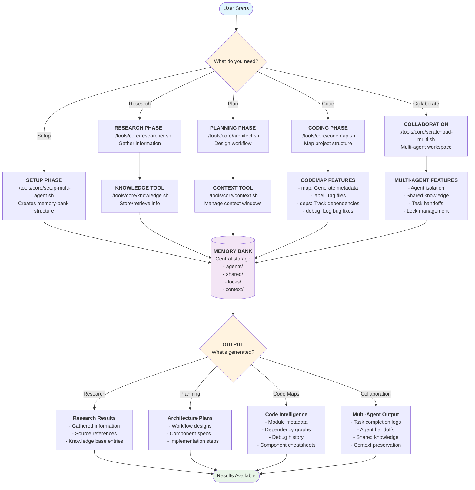

# llm-agent-tools

## System Architecture Flowchart



## Value Proposition

A suite of command-line tools to streamline and enhance LLM agent workflows. This project provides modular, easy-to-use utilities designed to improve productivity and simplify complex tasks related to large language model agents.

## Quick Start

Get started in 30 seconds:

1. **One-Line Install**:

   ```bash
   curl -s https://raw.githubusercontent.com/larock22/llm-agent-tools/main/install.sh | bash
   ```

   Or manual install:
   ```bash
   wget https://raw.githubusercontent.com/larock22/llm-agent-tools/main/install.sh
   chmod +x install.sh
   ./install.sh
   ```

2. **Initialize Workspace**:

   ```bash
   ./setup-multi-agent.sh
   ```

3. **Choose Your Workflow**:

   ```bash
   # Research a topic
   ./researcher.sh "machine learning best practices"

   # Plan a project 
   ./architect.sh

   # Map existing code
   ./codemap.sh map

   # Start collaborative work
   ./scratchpad-multi.sh --agent myagent start "Build API"
   ```

## Tool Overview

### Core Tools (`tools/core/`)

| Tool | Purpose | Use When |
|------|---------|----------|
| **setup-multi-agent.sh** | Initialize workspace | Starting new project |
| **researcher.sh** | Gather information | Need to research topic |
| **architect.sh** | Plan workflows | Designing system architecture |
| **codemap.sh** | Map code structure | Working with existing codebase |
| **knowledge.sh** | Store/retrieve facts | Managing persistent knowledge |
| **context.sh** | Manage context windows | Handling large contexts |
| **scratchpad-multi.sh** | Multi-agent collaboration | Team development |

### Directory Structure

```text
llm-agent-tools/
├── tools/core/          # Main executable scripts
├── docs/               # All documentation
│   ├── setup/         # Installation guides
│   ├── tools/         # Individual tool docs
│   ├── guides/        # Workflow examples
│   └── changelog/     # Change history
├── memory-bank/       # Persistent agent memory
├── architecture/      # Project architecture docs
└── examples/         # Usage examples
```

## Common Workflows

### Solo Development

```bash
./setup-multi-agent.sh       # Initialize
./researcher.sh "topic"      # Research
./architect.sh               # Plan
./codemap.sh map            # Map code
./scratchpad-multi.sh       # Execute
```

### Multi-Agent Team

```bash
# Agent A: Research
./researcher.sh "requirements" --agent researcher

# Agent B: Architecture  
./architect.sh --agent architect

# Agent C: Implementation
./scratchpad-multi.sh --agent developer start "Build feature"
```

## Documentation

- **[Setup Guide](docs/setup/)** - Installation and configuration
- **[Tool Reference](docs/tools/)** - Detailed tool documentation  
- **[Workflow Guide](docs/guides/)** - Usage patterns and examples
- **[System Architecture](docs/guides/system-workflow.md)** - Complete flowchart and patterns
- **[Changelog](docs/changelog/)** - Version history and updates
