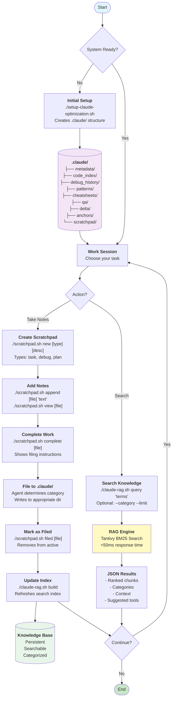

# System Flow - Claude-Optimized LLM Agent Tools



## Key Workflow Patterns

### 1. **Note-Taking Pattern**
```
Create → Write → Complete → File → Index
```

### 2. **Search Pattern**
```
Query → RAG → Results → Use
```

### 3. **Knowledge Growth**
```
Work → Document → File → Search Later
```

## Tool Commands Reference

### Scratchpad Workflow
```bash
# Create
./scratchpad.sh new task "implement feature"

# Work
./scratchpad.sh append task_implement_feature "notes"

# Complete
./scratchpad.sh complete task_implement_feature

# File (done by agent)
# Then mark as filed
./scratchpad.sh filed task_implement_feature
```

### Search Workflow
```bash
# Build/update index
./claude-rag.sh build

# Search everything
./claude-rag.sh query "search terms"

# Search specific category
./claude-rag.sh query "debug" --category debug_history

# Limit results
./claude-rag.sh query "patterns" --limit 5
```

## System Benefits

- **Simple**: 3 tools, clear workflow
- **Fast**: Indexed search, quick retrieval
- **Persistent**: Knowledge accumulates
- **Organized**: Automatic categorization
- **Scalable**: Handles large knowledge bases