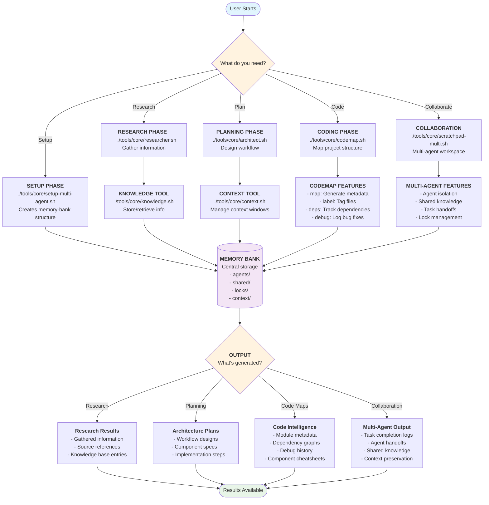
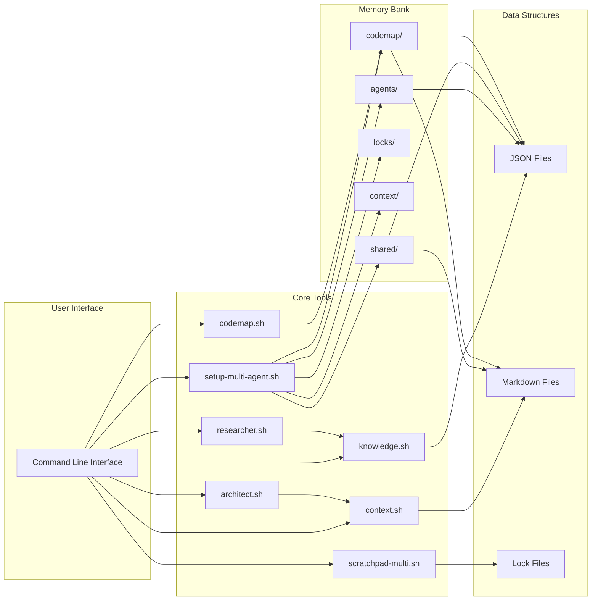

# LLM Agent Tools - System Workflow

## System Architecture Flowchart



## Tool Interaction Flow



## Workflow Patterns

### Pattern 1: Solo Development

```bash
1. setup-multi-agent.sh     → Initialize workspace
2. researcher.sh            → Gather requirements  
3. architect.sh             → Plan implementation
4. codemap.sh map           → Generate project map
5. scratchpad-multi.sh      → Execute tasks
```

### Pattern 2: Multi-Agent Collaboration

```bash
1. setup-multi-agent.sh                    → Initialize shared workspace
2. Agent A: researcher.sh                  → Research phase
3. Agent A → Agent B: knowledge handoff    → Share findings
4. Agent B: architect.sh                   → Design phase  
5. Agent B → Agent C: context handoff      → Share design
6. Agent C: codemap.sh + implementation    → Build phase
```

### Pattern 3: Iterative Development

```bash
1. codemap.sh init          → Initialize tracking
2. scratchpad-multi.sh      → Implement feature
3. codemap.sh debug         → Log issues found
4. context.sh               → Update context
5. scratchpad-multi.sh      → Fix issues
6. Repeat 2-5 as needed
```

## Key Features

### Multi-Agent Coordination

- Isolated agent workspaces
- Shared knowledge base
- Lock-based coordination
- Task handoff system

### Intelligence Layer

- Code mapping and metadata
- Context window management  
- Knowledge persistence
- Debug history tracking

### Developer Experience

- Consistent CLI interface
- Clear help documentation
- Backward compatibility
- Modular tool design

### Organized Structure

- Centralized memory bank
- Categorized documentation
- Separated core/legacy tools
- Example workflows
